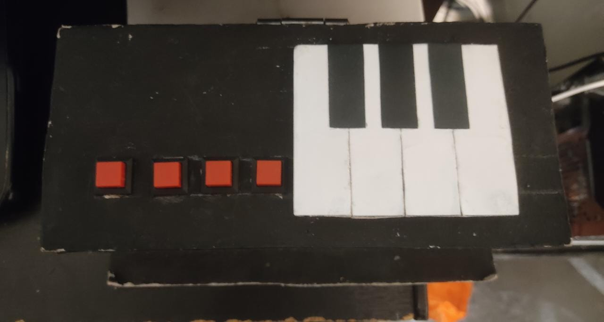
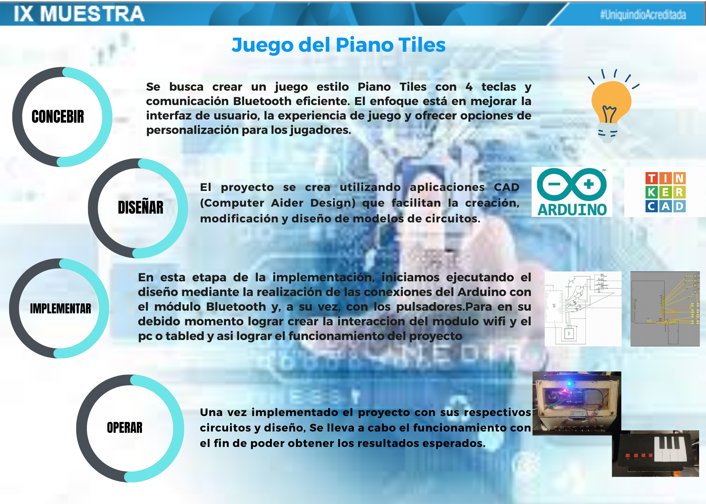

# Juego_Piano
## PROPOSITO DEL JUEGO 
El objetivo de este juego es permitir la comunicación a través de Bluetooth, además de implementar diferentes tipos de códigos que se han estudiado previamente en las clases de sistemas digitales. Se basa en el juego "PIANO TILES" y no solo nos proporciona entretenimiento, sino que también nos desafía a utilizar la coordinación visual y táctil para ganar el juego.
## INSTRUCCIONES DEL JUEGO 
El juego se inicia al pulsar algunas teclas de juego. A continuación, una secuencia de teclas desciende por la pantalla, indicando cuáles deben ser presionadas. Cuando la secuencia alcanza un área específica, se debe presionar la tecla correspondiente a cada espacio. Si se presiona correctamente al mismo tiempo que la secuencia está en el área designada, el usuario obtendrá un punto. De lo contrario, se descontará una vida. El usuario tiene un número limitado de vidas disponibles
## DESCRIPCION DE MANDO

Para la elaboración del mando se utilizó un Arduino y un módulo Bluetooth, su función es leer las pulsaciones que se harán en las teclas del piano las cuales están localizadas en el panel superior del mando, y enviarlas en forma de información de manera  inalámbrica e instantanea al dispositivo en el cuál se ejecuta el juego y que este procese e interprete dicha información para ejecutar las acciones que podrán observar al jugar.

## INFOGRAFIA

## CREDITOS
Juan Jose Devia Espinosa juanj.deviae@uqvirtual.edu.co

Diego Alejandro Vallejo  diegoa.vallejor@uqvirtual.edu.co
 
Jhon Alexander Cartagena jhona.cartagenav@uqvirtual.edu.co

Oscar Mauricio Cabezas Riascos oscarm.cabezasr@uqvirtual.edu.co

